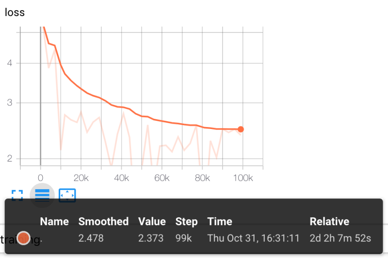
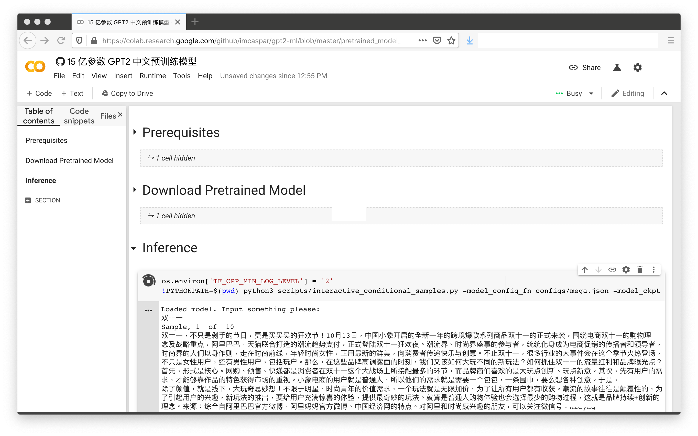

# **GPT2** for Multiple Languages

[](https://colab.research.google.com/github/imcaspar/gpt2-ml/blob/master/pretrained_model_demo.ipynb)
[](https://github.com/imcaspar/gpt2-ml)
[](https://github.com/imcaspar/gpt2-ml/releases)
[](https://github.com/imcaspar/gpt2-ml/issues)
[](https://github.com/imcaspar/gpt2-ml)

[**中文说明**](./README_CN.md) | [**English**](./README.md)

- [x] 简化整理 GPT2 训练代码（based on Grover, supporting TPUs）
- [x] 移植 bert tokenizer，添加多语言支持
- [x] 15亿参数 GPT2 中文预训练模型( 15G 语料，训练 10w 步 )
- [x] 开箱即用的模型生成效果 demo [#](https://github.com/imcaspar/gpt2-ml#google-colab)
- [x] 15亿参数 GPT2 中文预训练模型( 30G 语料，训练 22w 步 )


## 预训练模型
| Size            | Language | Corpus | Vocab                 | Link                                                         | SHA256                                                       |
| --------------- | -------- | ------ | --------------------- | ------------------------------------------------------------ | ------------------------------------------------------------ |
| 1.5B parameters | Chinese  | ~30G   | CLUE ( 8021 tokens )  | [**Google Drive**](https://drive.google.com/file/d/1mT_qCQg4AWnAXTwKfsyyRWCRpgPrBJS3) | e698cc97a7f5f706f84f58bb469d614e<br/>51d3c0ce5f9ab9bf77e01e3fcb41d482 |
| 1.5B parameters | Chinese  | ~15G   | Bert ( 21128 tokens ) | [**Google Drive**](https://drive.google.com/file/d/1IzWpQ6I2IgfV7CldZvFJnZ9byNDZdO4n) | 4a6e5124df8db7ac2bdd902e6191b807<br/>a6983a7f5d09fb10ce011f9a073b183e |

训练语料来自 [THUCNews](http://thuctc.thunlp.org/#%E4%B8%AD%E6%96%87%E6%96%87%E6%9C%AC%E5%88%86%E7%B1%BB%E6%95%B0%E6%8D%AE%E9%9B%86THUCNews) 以及 [nlp_chinese_corpus](https://github.com/brightmart/nlp_chinese_corpus)，清洗后总文本量约 15G 

使用 [Cloud TPU Pod v3-256](https://cloud.google.com/tpu/docs/types-zones#types) 训练 22w 步




## Google Colab
只需两次鼠标点击（不包括 Colab 授权流程），体验 15 亿参数中文预训练模型生成效果：

[**[Colab Notebook]**](https://colab.research.google.com/github/imcaspar/gpt2-ml/blob/master/pretrained_model_demo.ipynb)



## 训练

## 免责声明
该项目中的内容仅供技术研究参考，不作为任何结论性依据。

## Citation

```
@misc{GPT2-ML,
  author = {Zhibo Zhang},
  title = {GPT2-ML: GPT-2 for Multiple Languages},
  year = {2019},
  publisher = {GitHub},
  journal = {GitHub repository},
  howpublished = {\url{https://github.com/imcaspar/gpt2-ml}},
}
```

## Reference
https://github.com/google-research/bert

https://github.com/rowanz/grover

Research supported with Cloud TPUs from Google's TensorFlow Research Cloud (TFRC)

## Press
[[机器之心] 只需单击三次，让中文GPT-2为你生成定制故事](https://mp.weixin.qq.com/s/FpoSNNKZSQOE2diPvJDHog)

[[科学空间] 现在可以用Keras玩中文GPT2了](https://kexue.fm/archives/7292)